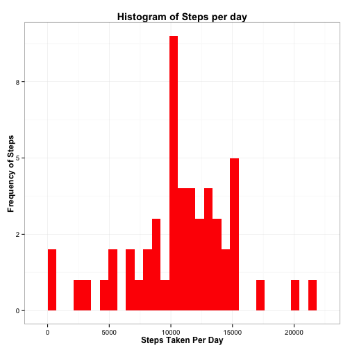
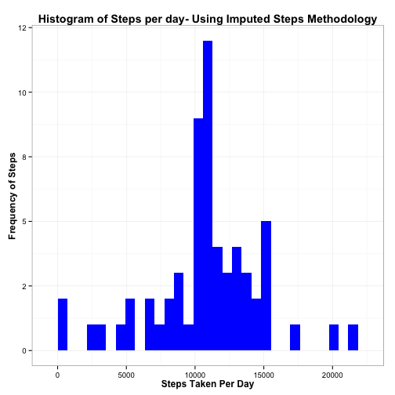
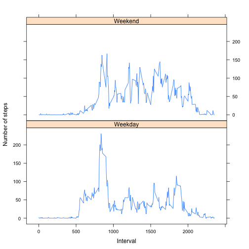

# Reproducible Research: Peer Assessment 1
==========================================
### Programmer:  Cary Correia    Date: July 18, 2014

### README first:
This is the first assignment for Reproducible Research.  
I used the 'PA1_template.Rmd' template to make it consistent with the rest of the coursera class participants to aid in marking.  

All code is included in the file and it is faithfully 'commented' to ensure that the reader can both fully understand the logic behind the routines and to also aid anyone who wishes to reproduce the results.

As you go through each part of the assignment you'll note that I follow this format:
- Each part of the assignment leads with a title that describes the assigment section and sub-section
- Overview of what my design choices were to complete the assignment section
- Code for the step,  echo'ed so the reader would see exactly what I was doing
- Results or analysis of the assignment.

## Loading and preprocessing the data
#### Prep the workspace, read and clean data
The data is a basic 'csv' file which is easily handled with a read.csv function.
Both 'date' and 'interval' fields had to be reformatted.
Note:  I disabled the scientific notation and set the number of digits to ease in readability of any output numbers

```r
setwd('/Users/carycorreia/Documents/Exploratory_Data_Project1/RepData_PeerAssessment1') # set up workspace
options(scipen=999, digits=1)                                                           # disable scientific notation; fix digits
data<-read.csv('activity.csv', header=TRUE, sep="," , na.strings="NA",)                 # read the data
data$date<-as.Date(data$date, format="%Y-%m-%d")                                        # reformat the date column
data$interval<- as.integer(data$interval)                                               # reformat the interval column
```
The result of this code is a data file which is cleaned up and ready to process
note:  The file is too large to reproduce the table in this document
## What is mean total number of steps taken per day?
#### 1. Make a histogram of the total number of steps taken each day
The data had to be aggregated into a table so that we could draw the histogram of the number of steps.
This meant taking the actual number of steps as our 'X' and then counting the number of times those steps appeared in the database.

The histogram code is shown below:

```r
library(ggplot2)
steps.per.day<-aggregate(steps~date, data, sum)                         # create count table for steps
ggplot(steps.per.day, aes(x=steps)) +                                   # start plot
        geom_histogram(fill="red", binwidth=(705))+                     # create histo with red fill
        theme_bw()+                                                     # remove gray background
        labs(title="Histogram of Steps per day")+                       # set the title
        ylab("Frequency of Steps")+                                     # set the y axis
        xlab("Steps Taken Per Day")+                                    # set the x axis
        theme(plot.title=element_text(lineheight=3, face="bold"))+      # format title
        theme(axis.title.x=element_text(lineheight=2, face="bold"))+    # format x-axis
        theme(axis.title.y=element_text(lineheight=2, face="bold"))     # format y-axis
```

 

The histogram above does not have any NA's in the database.
These were removed when I used the aggregate function to create the table that fed the histogram.

Note:  I did not convert missing values into 0's.  Performing this step would distort the output measure and be an error.
Missing data points are exactly that....missing.  My process follows this format.

#### 2. Calculate and report the mean and median total number of steps taken per day
Once the data table was set up to perform the histogram it was easy enough to simply call the mean() and median() functions.

```r
mean.steps<-mean(steps.per.day$steps, na.rm=TRUE)               # calc the mean
median.steps<-median(steps.per.day$steps, na.rm=TRUE)           # calc the median
```

#### Output Results:
##### The mean for the number of steps per day is 10766.2.
##### The median for the number of steps per day is 10765.

## What is the average daily activity pattern?
#### 1. Make a time series plot (ie: type = "l") of Interval and avg # of Steps
In this part of the assignment I wanted to create a "clean" set of data without the NA's.  Later on I will use the nrow() on this dataset to calculate the number of NA's.  Then I utilize the tapply function to calculate the mean for every 5-min interval (as stated in the assignment notes).  

The following code creates the time series plot:

```r
data.clean<-data[!is.na(data$steps),]                                                   # take out na's
mean.col<-as.data.frame(tapply(data.clean$steps, data.clean$interval, mean))            # calc the mean per interval
mean.matrix<-cbind(unique(data.clean$interval), mean.col)                               # create a matrix with means
names(mean.matrix)<-c("interval","avgSteps")                                            # fix the col names
##      Draw the plot
        with(mean.matrix, plot(interval, avgSteps, type="l", ann=FALSE))                # start time series plot          
        title(main="Average Steps vs 5-Minute Interval",                                # set the title
        sub=NULL, xlab="5 Minute Interval", ylab="Average Number of Steps")             # set axis labels
```

 

#### Analysis of Graph
The output graph shows fairly low activity between the 0 to 500 interval mark. 
The activity then start to gradually ramp up then die back down again with some variability until the 2000th interval.
At this point the activity starts to ramp down to very low activity.

The following code is used to determine the high point of activity and the interval where it occurred.

```r
## Determine the 5minute interval where we had the highest number of average steps
H.interval<-mean.matrix[mean.matrix$avgSteps==max(mean.matrix$avgSteps),]   # calculate the high point
## Determine the interval where that maximum occurred        
max.interval<-  H.interval$interval                                         # save interval where max occurrs
```
##### The interval where the maximum average number of steps (206.2) occurs is 835.

## Imputing missing values
#### 1. Calculate and Report the total number of missing values
The calculation for the number of NA rows is simply created by finding the difference betweed the number of rows in the full dataset and the number of rows from my clean database

The following difference code is used:

```r
na.total<-nrow(data)-nrow(data.clean)
```
#### Output
The total number of missing values in the dataset is 2304

#### 2. Devise a strategy for filling in all of the missing values in the dataset
A simple way to impute or fill in the missing data is to take the average of the intervals.  For any given interval the average of the non-missing interval values will then be inserted into the database where the NA's were located.

The code below is tagged with pseudo-code comments to walk the reader through the logic and steps for the imputation:

```r
## Create a data quality field to track good steps and bad steps
data$step.bad<-is.na(data$steps)
## Copy the full steps column into a new column....this will be used to overwrite the NAs
data$Impute<-data$steps
## Create a "replace" index...ie: this will be a vector to identify the replacements
replace<-which(is.na(data$steps))
## Replace the NA values with the average of each interval
data2<-merge(data, mean.matrix, by="interval", sort=FALSE)
data2<-data2[with(data2, order(date,interval)),]
data[replace, 5]<-data2[replace,6]
##
```
The resulting database is exactly the same size as the original database but where we had NA's the dataset now has the average for that reading's interval.
Note:  I did not post the results of that file because of its size

#### 3. Create a new dataset that is equal to the original dataset but with the missing data filled in
As I was working on the files I opted to build off of the 'data' table I originally ingested.
At this point I had already built up a couple of redundant columns ('step.bad', and "Impute").  In order to fulfull this part of the assignment I simply had to copy 'data' to a new file ('data.new') drop the original 'steps' column (because this one had NA's in it), drop the 'steps.bad' column (because it wasn't needed) and then rename my columns to match the original dataset

The following code performs these steps:

```r
data.new<-data                                       # copy the original dataset into a new dataset
drops<-c("steps","step.bad")                         # identify columns for removal
data.new<-data.new[,!(names(data.new)%in% drops)]    # drop the columns
data.new<-data.new[c("Impute","date","interval")]    # reorder the columns
names(data.new)<-c("steps", "date", "interval")      # fix the column names to match the original
new.size<-nrow(data.new)
```

The resulting database has 3 variables with 17568 rows.
Note:  I did not post the results of that file because of its size


#### 4. Make a histogram of the total number of steps taken each day and calculate and report the mean and median
This step was very similar to the original histogram but this time we use the new dataset so we can contrast the two graphs and look at what impact our imputation would have on the output.  I opted to produce the original graph in red and the new graph in blue.

The following code shows how to create the new histogram:

```r
steps.per.day2<-aggregate(steps~date, data.new, sum)  
ggplot(steps.per.day2, aes(x=steps)) +
        geom_histogram(fill="blue", , binwidth=(705))+
        theme_bw()+
        labs(title="Histogram of Steps per day- Using Imputed Steps Methodology")+
        ylab("Frequency of Steps")+
        xlab("Steps Taken Per Day")+
        theme(plot.title=element_text(lineheight=2, face="bold"))+
        theme(axis.title.x=element_text(lineheight=1, face="bold"))+
        theme(axis.title.y=element_text(lineheight=1, face="bold"))
```

 

The resulting graph shows a similar distribution pattern.
There is of course more points which show up near the central part of the graph.

The following code is use to calculate the new mean and median.
I also compute the differential between old and new means and medians to quantify the impact of the imputation:

```r
##     Calculate and report the mean and median total number of steps taken per day
mean.steps.2<-mean(steps.per.day2$steps)
median.steps.2<-median(steps.per.day2$steps)        

impact.mean<-mean.steps - mean.steps.2
impact.median<-median.steps - median.steps.2
```

The new dataset has a mean of 10766.2 and a median of 10766.2

The difference between the means is 0; Result: no large shift in the output mean
The difference between the medians is -1.2; Result: no large shift in the output median

## Are there differences in activity patterns between weekdays and weekends?
For this part of the assignment we had to take the date and then compute whether that data point fell on a weekend or a weekday and then we would graph the results to see if there was any visual differences between the two.

I opted to use the weekdays() function to determine the day that the date fell on.  Then I built a lookup table for each day that corresponding to 'weekend' or 'weekday'.  I then used the merge function to 'lookup' each day and fill in the weekend/day value.

The following code performs the "weekday / weekend"" encoding:

```r
##      Add in day of the week
day<-as.data.frame(weekdays(data.new$date))
names(day)<-"day"
data.withDay<-cbind(data.new$steps, data.new$date, data$interval, day); names(data.withDay)<-c("steps", "date", "interval", "day")
##      Add in Weekend or Weekday
weekDay<-c("Sunday", "Monday", "Tuesday", "Wednesday", "Thursday", "Friday", "Saturday")
Type<-c("Weekend", rep("Weekday", 5), "Weekend")
DayType<-as.data.frame(cbind(weekDay, Type))
data.withDay<-merge(x=data.withDay, y=DayType, by.x="day", by.y="weekDay")
data.withDay<-data.withDay[with(data.withDay, order(date,interval)),]
data.withDay$Type<-as.factor(data.withDay$Type)
```

####      Create the panel plot for the output
This last part of the assignment calls for us to create a panel plot.

The only tricky part was to calculate the averages for not only the average number of steps by interval but also to take into account the weekend or weekday factor.  The tapply function worked out well to calculate the means for both interval and weekend/day.  

Note:  the output of the tapply is a matrix table.
       this table has to be reshaped into a normal data.frame in order to do the plots
       
The following code performs the mean calculation, reshape and plots:

```r
##      Prep the data (calculate the means)
answer<-tapply(data.withDay$steps, list(weektype=data.withDay$Type, interval=data.withDay$interval), mean)

library(reshape)
df<-melt(answer, varnames=c("Type", "Interval"), value.name="AvgSteps")
##      Create the graph
 library("lattice")
with(df, xyplot(value~Interval|Type, type="l", ann=FALSE, ylab="Number of steps", layout=c(1,2)))
```

 
#### Output
The resulting two panel plot shows the following:
- activity starts earlier for the weekday activity graph; so people are more active earlier in the day
- once people are up on weekends, there is consistently more activity throughout the day  

